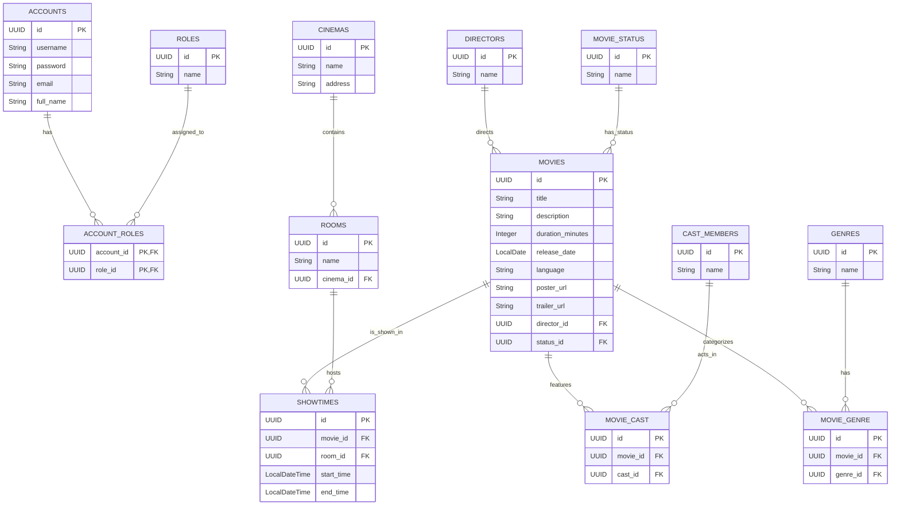

# Database Schema - Movie Booking System

> **Database Name:** `movie_booking_db`
> **Collation:** `utf8mb4_unicode_ci`
> **Mô tả:** Hệ thống cơ sở dữ liệu quản lý rạp chiếu phim, lịch chiếu, tài khoản (khách hàng/nhân viên) và hệ thống đặt vé/đồ ăn.

---

## 1. Lược đồ đã hoàn thiện (Implemented Schema)

Phần này mô tả cấu trúc database cho các tính năng đã được code trong project. Lược đồ này sử dụng `UUID` làm khóa chính cho các thực thể chính, đồng bộ với các lớp Entity trong mã nguồn Java.

### 1.1. Sơ đồ thực thể kết nối (ER Diagram)



### 1.2. Bảng (Tables)

#### `accounts`, `roles`, `account_roles`
*(Cấu trúc dựa trên Spring Security và các Entity liên quan)*

#### `movies`
| Column | Type | Constraints | Description |
|---|---|---|---|
| `id` | `UUID` | `PRIMARY KEY` | Khóa chính |
| `title` | `VARCHAR(255)` | `NOT NULL` | Tên phim |
| `description` | `TEXT` | | Mô tả phim |
| `duration_minutes` | `INT` | | Thời lượng (phút) |
| `release_date` | `DATE` | | Ngày phát hành |
| `language` | `VARCHAR(255)` | | Ngôn ngữ |
| `poster_url` | `VARCHAR(255)` | | Link ảnh poster |
| `trailer_url` | `VARCHAR(255)` | | Link trailer |
| `director_id` | `UUID` | `FOREIGN KEY (directors.id)` | Khóa ngoại đến đạo diễn |
| `status_id` | `UUID` | `FOREIGN KEY (movie_status.id)` | Khóa ngoại đến trạng thái phim |

#### `directors`
| Column | Type | Constraints | Description |
|---|---|---|---|
| `id` | `UUID` | `PRIMARY KEY` | Khóa chính của đạo diễn |
| `name` | `VARCHAR(100)` | `NOT NULL` | Tên đạo diễn |

#### `movie_status`
| Column | Type | Constraints | Description |
|---|---|---|---|
| `id` | `UUID` | `PRIMARY KEY` | Khóa chính của trạng thái phim |
| `name` | `VARCHAR(50)` | `NOT NULL, UNIQUE` | Tên trạng thái (ví dụ: "Now Showing", "Coming Soon") |

#### `cast_members`
| Column | Type | Constraints | Description |
|---|---|---|---|
| `id` | `UUID` | `PRIMARY KEY` | Khóa chính của thành viên diễn viên |
| `name` | `VARCHAR(100)` | `NOT NULL` | Tên diễn viên |

#### `genres`
| Column | Type | Constraints | Description |
|---|---|---|---|
| `id` | `UUID` | `PRIMARY KEY` | Khóa chính của thể loại |
| `name` | `VARCHAR(50)` | `NOT NULL, UNIQUE` | Tên thể loại (ví dụ: "Action", "Comedy") |

#### `movie_cast`
| Column | Type | Constraints | Description |
|---|---|---|---|
| `id` | `UUID` | `PRIMARY KEY` | Khóa chính của bảng trung gian |
| `movie_id` | `UUID` | `NOT NULL, FOREIGN KEY (movies.id)` | Khóa ngoại đến phim |
| `cast_id` | `UUID` | `NOT NULL, FOREIGN KEY (cast_members.id)` | Khóa ngoại đến diễn viên |
| | | `UNIQUE (movie_id, cast_id)` | Đảm bảo một diễn viên chỉ được gán cho một phim một lần |

#### `movie_genre`
| Column | Type | Constraints | Description |
|---|---|---|---|
| `id` | `UUID` | `PRIMARY KEY` | Khóa chính của bảng trung gian |
| `movie_id` | `UUID` | `NOT NULL, FOREIGN KEY (movies.id)` | Khóa ngoại đến phim |
| `genre_id` | `UUID` | `NOT NULL, FOREIGN KEY (genres.id)` | Khóa ngoại đến thể loại |
| | | `UNIQUE (movie_id, genre_id)` | Đảm bảo một thể loại chỉ được gán cho một phim một lần |

#### `cinemas`
| Column | Type | Constraints | Description |
|---|---|---|---|
| `id` | `UUID` | `PRIMARY KEY` | Khóa chính của rạp |
| `name` | `VARCHAR(255)` | `NOT NULL` | Tên rạp |
| `address`| `VARCHAR(255)`| | Địa chỉ của rạp |

#### `rooms`
| Column | Type | Constraints | Description |
|---|---|---|---|
| `id` | `UUID` | `PRIMARY KEY` | Khóa chính của phòng chiếu |
| `name` | `VARCHAR(255)` | `NOT NULL` | Tên phòng chiếu (ví dụ: "Phòng 1", "IMAX") |
| `cinema_id` | `UUID` | `NOT NULL, FOREIGN KEY (cinemas.id)` | Khóa ngoại đến rạp chứa phòng này |

#### `showtimes`
| Column | Type | Constraints | Description |
|---|---|---|---|
| `id` | `UUID` | `PRIMARY KEY` | Khóa chính của lịch chiếu |
| `movie_id` | `UUID` | `NOT NULL, FOREIGN KEY (movies.id)` | Khóa ngoại đến phim được chiếu |
| `room_id` | `UUID` | `NOT NULL, FOREIGN KEY (rooms.id)` | Khóa ngoại đến phòng chiếu |
| `start_time` | `DATETIME` | `NOT NULL` | Thời gian bắt đầu chiếu |
| `end_time` | `DATETIME` | `NOT NULL` | Thời gian kết thúc (dự kiến) |

---

## 2. Lược đồ toàn bộ dự án (Full Project Schema)

Đây là kịch bản SQL đầy đủ cho toàn bộ các tính năng dự kiến của project. Lược đồ này sử dụng `INT AUTO_INCREMENT` cho các bảng danh mục và `UUID` (dưới dạng `VARCHAR(36)`) cho các bảng dữ liệu chính.

```sql
-- Tạo Database (Bạn có thể đổi tên tùy ý)
CREATE DATABASE IF NOT EXISTS movie_booking_db DEFAULT CHARACTER SET utf8mb4 COLLATE utf8mb4_unicode_ci;
USE movie_booking_db;

-- ==========================================
-- PHẦN 1: CÁC BẢNG DANH MỤC ĐỘC LẬP (KHÔNG CÓ KHÓA NGOẠI)
-- ==========================================

CREATE TABLE roles (
    id INT AUTO_INCREMENT PRIMARY KEY,
    name VARCHAR(50) NOT NULL UNIQUE -- e.g., ROLE_USER, ROLE_ADMIN
);

CREATE TABLE state (
    id INT AUTO_INCREMENT PRIMARY KEY,
    name VARCHAR(50) NOT NULL -- e.g., Active, Maintenance
);

CREATE TABLE seat_type (
    id INT AUTO_INCREMENT PRIMARY KEY,
    name VARCHAR(50) NOT NULL -- e.g., Normal, VIP
);

CREATE TABLE ticket_type (
    id INT AUTO_INCREMENT PRIMARY KEY,
    name VARCHAR(50) NOT NULL,
    base_price DECIMAL(10, 2) NOT NULL
);

CREATE TABLE snack_type (
    id INT AUTO_INCREMENT PRIMARY KEY,
    name VARCHAR(50) NOT NULL
);

CREATE TABLE directors (
    id INT AUTO_INCREMENT PRIMARY KEY,
    name VARCHAR(100) NOT NULL
);

CREATE TABLE cast_members (
    id INT AUTO_INCREMENT PRIMARY KEY,
    name VARCHAR(100) NOT NULL
);

CREATE TABLE genres (
    id INT AUTO_INCREMENT PRIMARY KEY,
    name VARCHAR(50) NOT NULL
);

CREATE TABLE movie_status (
    id INT AUTO_INCREMENT PRIMARY KEY,
    name VARCHAR(50) NOT NULL -- e.g., Now Showing, Coming Soon
);

-- ==========================================
-- PHẦN 2: CÁC BẢNG CÓ PHỤ THUỘC (CÓ KHÓA NGOẠI)
-- ==========================================

CREATE TABLE cinemas (
    id INT AUTO_INCREMENT PRIMARY KEY,
    name VARCHAR(100) NOT NULL,
    state_id INT,
    FOREIGN KEY (state_id) REFERENCES state(id)
);

CREATE TABLE theatres (
    id INT AUTO_INCREMENT PRIMARY KEY,
    cinema_id INT NOT NULL,
    theatre_num VARCHAR(20) NOT NULL,
    FOREIGN KEY (cinema_id) REFERENCES cinemas(id)
);

CREATE TABLE seats (
    id INT AUTO_INCREMENT PRIMARY KEY,
    theatre_id INT NOT NULL,
    seat_type_id INT NOT NULL,
    seat_location VARCHAR(10) NOT NULL, -- e.g., A1, B2
    FOREIGN KEY (theatre_id) REFERENCES theatres(id),
    FOREIGN KEY (seat_type_id) REFERENCES seat_type(id)
);

CREATE TABLE snacks (
    id INT AUTO_INCREMENT PRIMARY KEY,
    snack_type_id INT NOT NULL,
    name VARCHAR(100) NOT NULL,
    base_price DECIMAL(10, 2) NOT NULL,
    FOREIGN KEY (snack_type_id) REFERENCES snack_type(id)
);

-- Bảng accounts (Có khóa ngoại trỏ về cinemas cho nhân viên rạp)
CREATE TABLE accounts (
    id VARCHAR(36) PRIMARY KEY, -- Sử dụng UUID
    email VARCHAR(100) NOT NULL UNIQUE,
    password_hash VARCHAR(255) NOT NULL,
    full_name VARCHAR(100),
    phone VARCHAR(20),
    cinema_id INT NULL, -- Cho phép NULL nếu là khách hàng bình thường
    FOREIGN KEY (cinema_id) REFERENCES cinemas(id)
);

-- Bảng trung gian N-N cho Users & Roles
CREATE TABLE account_roles (
    account_id VARCHAR(36) NOT NULL,
    role_id INT NOT NULL,
    PRIMARY KEY (account_id, role_id),
    FOREIGN KEY (account_id) REFERENCES accounts(id),
    FOREIGN KEY (role_id) REFERENCES roles(id)
);

CREATE TABLE movies (
    id VARCHAR(36) PRIMARY KEY, -- Sử dụng UUID
    director_id INT,
    status_id INT NOT NULL,
    title VARCHAR(200) NOT NULL,
    description TEXT,
    duration_minutes INT,
    release_date DATE,
    FOREIGN KEY (director_id) REFERENCES directors(id),
    FOREIGN KEY (status_id) REFERENCES movie_status(id)
);

-- Bảng trung gian N-N
CREATE TABLE movie_cast (
    movie_id VARCHAR(36) NOT NULL,
    cast_id INT NOT NULL,
    PRIMARY KEY (movie_id, cast_id),
    FOREIGN KEY (movie_id) REFERENCES movies(id),
    FOREIGN KEY (cast_id) REFERENCES cast_members(id)
);

CREATE TABLE movie_genre (
    movie_id VARCHAR(36) NOT NULL,
    genre_id INT NOT NULL,
    PRIMARY KEY (movie_id, genre_id),
    FOREIGN KEY (movie_id) REFERENCES movies(id),
    FOREIGN KEY (genre_id) REFERENCES genres(id)
);

CREATE TABLE showing_time (
    id VARCHAR(36) PRIMARY KEY, -- Sử dụng UUID
    movie_id VARCHAR(36) NOT NULL,
    theatre_id INT NOT NULL,
    showing_datetime DATETIME NOT NULL,
    FOREIGN KEY (movie_id) REFERENCES movies(id),
    FOREIGN KEY (theatre_id) REFERENCES theatres(id)
);

-- ==========================================
-- PHẦN 3: GIAO DỊCH, HÓA ĐƠN VÀ VÉ
-- ==========================================

CREATE TABLE bookings (
    id VARCHAR(36) PRIMARY KEY, -- Sử dụng UUID
    account_id VARCHAR(36) NULL, -- Cho phép NULL nếu là khách vãng lai (Guest)
    showing_id VARCHAR(36) NOT NULL,
    total_amount DECIMAL(12, 2) NOT NULL,
    payment_status VARCHAR(20) NOT NULL, -- PENDING, PAID, CANCELLED
    created_datetime DATETIME NOT NULL,
    FOREIGN KEY (account_id) REFERENCES accounts(id),
    FOREIGN KEY (showing_id) REFERENCES showing_time(id)
);

CREATE TABLE booking_ticket (
    id VARCHAR(36) PRIMARY KEY, -- Sử dụng UUID
    booking_id VARCHAR(36) NOT NULL,
    ticket_type_id INT NOT NULL,
    ticket_qty INT NOT NULL,
    purchase_price DECIMAL(10, 2) NOT NULL, -- [QUAN TRỌNG] Chốt giá tại thời điểm mua
    FOREIGN KEY (booking_id) REFERENCES bookings(id),
    FOREIGN KEY (ticket_type_id) REFERENCES ticket_type(id)
);

CREATE TABLE booking_snack (
    id VARCHAR(36) PRIMARY KEY, -- Sử dụng UUID
    booking_id VARCHAR(36) NOT NULL,
    snack_id INT NOT NULL,
    snack_qty INT NOT NULL,
    purchase_price DECIMAL(10, 2) NOT NULL, -- [QUAN TRỌNG] Chốt giá tại thời điểm mua
    FOREIGN KEY (booking_id) REFERENCES bookings(id),
    FOREIGN KEY (snack_id) REFERENCES snacks(id)
);

CREATE TABLE booking_seat (
    id VARCHAR(36) PRIMARY KEY, -- Sử dụng UUID
    booking_id VARCHAR(36) NOT NULL,
    seat_id INT NOT NULL,
    FOREIGN KEY (booking_id) REFERENCES bookings(id),
    FOREIGN KEY (seat_id) REFERENCES seats(id)
);
```
